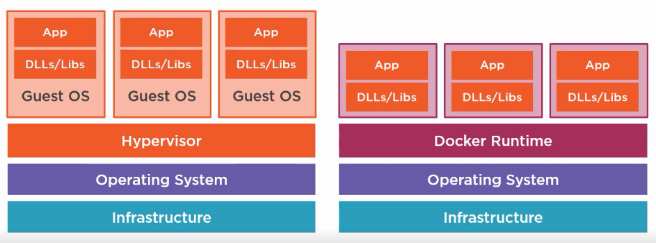
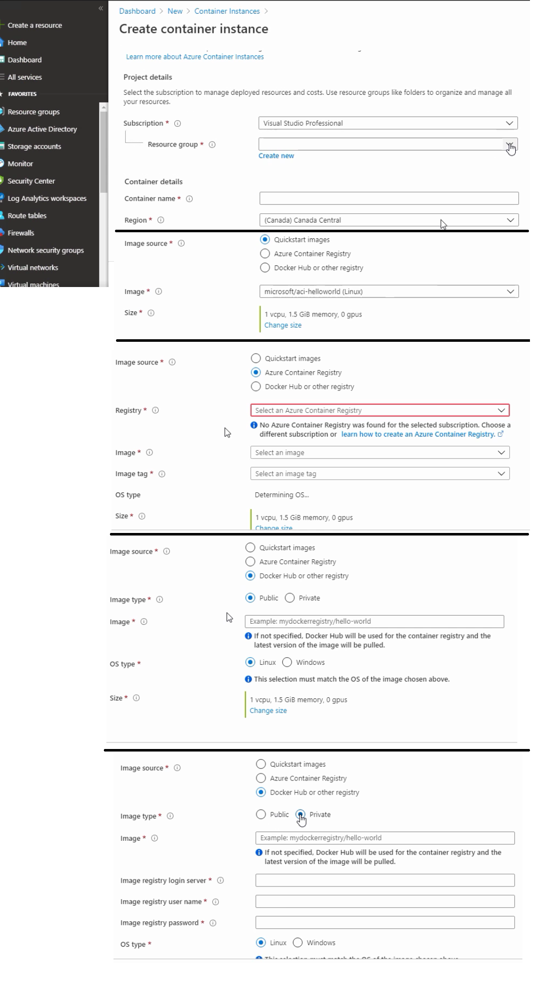
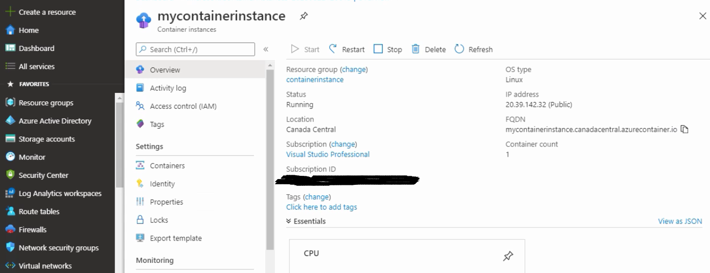

## Az-900 exam preparation Page 2 (Azure Services and Concepts)
##### Quick links
- [Azure Virtual machines](https://docs.microsoft.com/en-us/azure/virtual-machines/)
- [Azure CLI to maintain VM](./AzureCliCommands.md)
- [Azure template for virtual machine](https://docs.microsoft.com/en-us/azure/virtual-machines/windows/quick-create-template)

# Table of Contents
1. [Azure Compute](#azure-compute)
2. [Azure Virtual Machine](#azure-virtual-machine)
3. [Container Options in Azure](#container-options-in-azure)
---
## Azure Compute
 - Virtual machines (IAAS)
 - Containers IAAS
 - Azure App Service (PAAS)
 - Server less computing (SAAS)
 - Networking products 
 - Azure CDN

##### Benefits 
   - Easy to Provision new resources from either Azure portal or command line
   - Pay for what you use
   - Platform as a service options available 
   - Scale depending on workloads

## Azure Virtual Machine
   Virtual machine is nothing but an Infra as a service where users will have full control over it and must maintain and patch the machines also. 
   - When creating a vm in Azure market place, user need to take care of Type of image, size of image & availability options.
   - Azure virtual machine Scale set to increase availability (Group of virtual machines maintained together)
      - Identical virtual machine with load balancing
      - Number of VMs can Scale out/in.
      - Spread across fault domains and update domains
      - Only pay for the underlying resources. 
   - Azure Batch(Also does same operation with different options)
      - Pool of virtual machines 
      - High performance computing 
   
   

   ##### Benefits

   - Can install custom software 
   - Can shut down to save cost
      - Manually or on a schedule
   - Enables Hybrid cloud
   - Familiar administrative model
   - lift and shift migration 
   - Azure site recovery 
   - Can access remotely

## Container Options in Azure
   Azure Container Apps enables executing application code packaged in any container and is unopinionated about runtime or programming model. With Container Apps, you enjoy the benefits of running containers while leaving behind the concerns of managing cloud infrastructure and complex container orchestrators.

   A container instance is nothing but a wrapper around your application to make sure the application runs successfully. Web apps are main examples where containers can be used. The wrapper contains everything to run the application like libraries, runtime, framework etc. Easy to maintain containers and to move from local work station to `Cloud(with container run time installed)` / `Azure container instances ACI` / `Azure kubernetes Services AKS` / `Azure App Service`.

##### Virtual Machine vs Containers    
   Note: `Docker hub` is a public container registry on web, also an open source platform that provides standard for container format and runtime for docker containers. 
   Similarly Azure have its own `Azure container Registry`, we can choose instances for our application during deployment.

   

   ##### ACI
   This for smaller applications like simple web apps, web tests scenarios, small scale batch processing. ACI only have single instance per container image which wont provide high availability and have limited scalability. Here you only pay for containers which is cost effective and simple to manage 
   ##### AKS
   This bit complex, multi container management and standardized architecture to host scalable apps and have high availability. This is more robust way of hosting with container based solution, lower cost compared VM hosting and improves agility by simplifying processes and reduces friction during deployment.

   - Container management system in Azure. 
   - Scale out container- based applications
   - Monitoring and deploying containers
   - Pods are groups of containers
   - Nodes are virtual machines
   - Can leverage VM scale sets
   - Azure container Registry
   - Azure monitor link

  ##### Create ACI 
  [Read more](https://docs.microsoft.com/en-us/azure/container-apps/get-started?tabs=bash) to create ACI using Azure CLI.
  - Search `container instances` in Create a new resource option. Than click `Create`. You also can change the size. 
   
  - Click next for Network options. where you can Provide Public DNS name and port to access your containers publicly or privately.
  - Click Next to Advanced tab to add environment variable if needed.
  - Once created once can view the instance like this. You can navigate to settings for Monitoring/ Scale/ log etc.
  

---
[Previous Page](./az900.md)   |   [Next Page]()
- Azure Functions: https://docs.microsoft.com/en-us/azure/azure-functions/
- Azure App Service: https://docs.microsoft.com/en-us/azure/app-service/
- Azure Kubernetes Service: https://docs.microsoft.com/en-us/azure/aks/
- Azure Cosmos DB: https://docs.microsoft.com/en-us/azure/cosmos-db/
- Azure Blob Storage: https://docs.microsoft.com/en-us/azure/storage/blobs/storage-blobs-introduction
- Azure Monitor: https://docs.microsoft.com/en-us/azure/azure-monitor/
- Azure Stream Analytics: https://docs.microsoft.com/en-us/azure/stream-analytics/
- Azure Logic Apps: https://docs.microsoft.com/en-us/azure/logic-apps/
- Azure Event Grid: https://docs.microsoft.com/en-us/azure/event-grid/
- Azure Service Bus: https://docs.microsoft.com/en-us/azure/service-bus/
- Azure API Management: https://docs.microsoft.com/en-us/azure/api-management/
- Azure DevOps: https://docs.microsoft.com/en-us/azure/devops/?view=azure-devops
- Azure Machine Learning: https://docs.microsoft.com/en-us/azure/machine-learning/
- Azure Cognitive Services: https://docs.microsoft.com/en-us/azure/cognitive-services/welcome
