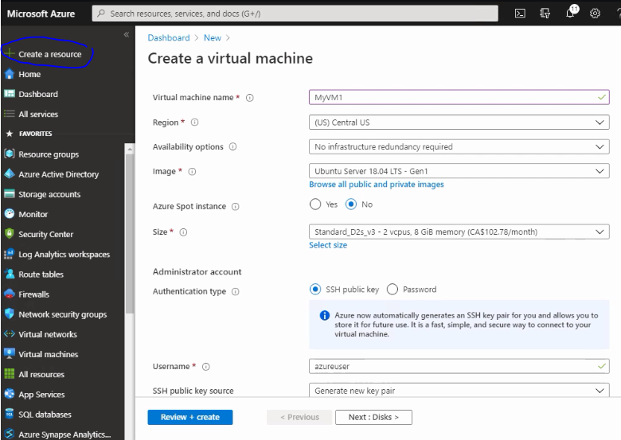

## Az-900 exam preparation Page 2 (Azure Services and Concepts)
##### Quick links
- [Azure Virtual machines](https://docs.microsoft.com/en-us/azure/virtual-machines/)
- [Azure CLI to maintain VM](./AzureCliCommands.md)
- [Azure template for virtual machine](https://docs.microsoft.com/en-us/azure/virtual-machines/windows/quick-create-template)

# Table of Contents
1. [Azure Compute](#azure-compute)
2. [Azure Virtual Machine](#azure-virtual-machine)
3. [Container Options in Azure](#container-options-in-azure)
---
## Azure Compute
 - Virtual machines (IAAS)
 - Containers IAAS
 - Azure App Service (PAAS)
 - Server less computing (SAAS)
 - Networking products 
 - Azure CDN

##### Benefits 
   - Easy to Provision new resources from either Azure portal or command line
   - Pay for what you use
   - Platform as a service options available 
   - Scale depending on workloads

---
## Azure Virtual Machine
   Virtual machine is nothing but an Infra as a service where users will have full control over it and must maintain and patch the machines also. 
   - When creating a vm in Azure market place, user need to take care of Type of image, size of image & availability options.
   - Azure virtual machine Scale set to increase availability (Group of virtual machines maintained together)
      - Identical virtual machine with load balancing
      - Number of VMs can Scale out/in.
      - Spread across fault domains and update domains
      - Only pay for the underlying resources. 
   - Azure Batch(Also does same operation with different options)
      - Pool of virtual machines 
      - High performance computing 
   
   

   ##### Benefits

   - Can install custom software 
   - Can shut down to same cost
      - Manually or on a schedule
   - Enables Hybrid cloud
   - Familiar administrative model
   - lift and shift migration 
   - Azure site recovery 
   - Can access remotely
---
## Container Options in Azure
---
[Previous Page](./az900.md)   |   [Next Page]()
- Azure Functions: https://docs.microsoft.com/en-us/azure/azure-functions/
- Azure App Service: https://docs.microsoft.com/en-us/azure/app-service/
- Azure Kubernetes Service: https://docs.microsoft.com/en-us/azure/aks/
- Azure Cosmos DB: https://docs.microsoft.com/en-us/azure/cosmos-db/
- Azure Blob Storage: https://docs.microsoft.com/en-us/azure/storage/blobs/storage-blobs-introduction
- Azure Monitor: https://docs.microsoft.com/en-us/azure/azure-monitor/
- Azure Stream Analytics: https://docs.microsoft.com/en-us/azure/stream-analytics/
- Azure Logic Apps: https://docs.microsoft.com/en-us/azure/logic-apps/
- Azure Event Grid: https://docs.microsoft.com/en-us/azure/event-grid/
- Azure Service Bus: https://docs.microsoft.com/en-us/azure/service-bus/
- Azure API Management: https://docs.microsoft.com/en-us/azure/api-management/
- Azure DevOps: https://docs.microsoft.com/en-us/azure/devops/?view=azure-devops
- Azure Machine Learning: https://docs.microsoft.com/en-us/azure/machine-learning/
- Azure Cognitive Services: https://docs.microsoft.com/en-us/azure/cognitive-services/welcome
