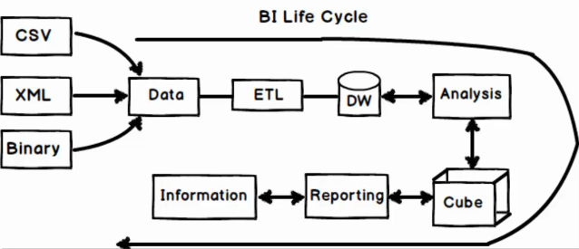
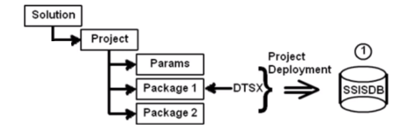

## MSBI (Microsoft Business Intelligence)
Business intelligence (BI) tools are types of application software that collect and process large amounts of unstructured data from internal and external systems, including books, journals, documents, health records, images, files, email, video, and other business sources. While not as flexible as business analytics tools, BI tools provide a way of amassing data to find information primarily through queries. These tools also help prepare data for analysis so that you can create reports, dashboards, and data visualizations. The results give both employees and managers the power to accelerate and improve decision making, increase operational efficiency, pinpoint new revenue potentials, identify market trends, report genuine KPIs, and identify new business opportunities.

---
##### Overview of MSBI

---
##### Prerequisite
MSBI is a combination of `SSIS, SSAS & SSRS`.

##### Software installation sequence due to dependencies

Notes:

- Sequence is very imp.
- Avoid installing 2019 version
- Sql server installation in custom mode with ssis and ssas and ssrs enabled
 - Need to install 2 instalnces if you need tabular and multidimentional.

 ##### Project Code SSIS

click on link to goto code [Sample Project](https://github.com/programfiction/SSIS)

 ##### Deployment

 

 ##### Project code SSAS
 Creating SSAS cube. forcasting application or heavy analysis application is ones where we can implement cube with SSAS. 